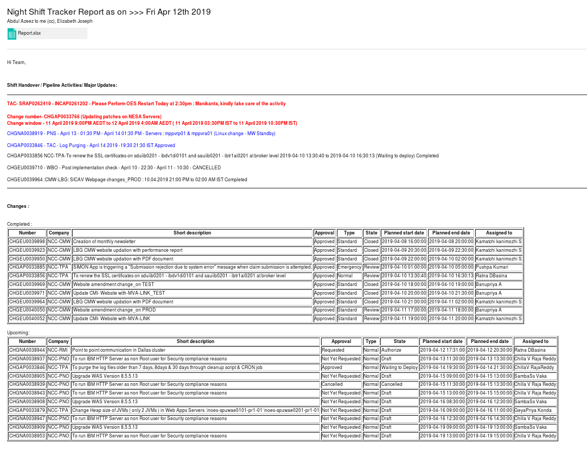

# Daily-Tracker

An Automation Script which does the following tasks
- Downloads incident and change tickets data from Service Now (Ticketing tool)
- Takes manual inputs from team (Individual Tracker and Major Updates)
- Assigns colour to Major Updates based on its priority
- Generates
    1. Changes - Completed changes and Upcoming changes for the current and next week.
    2. Incidents - Incoming, SLA Hold, In Progress, Resolved, Response Breach and Resolution Breach for current day
    3. Service Requests for current day
- Creates an HTML report and Excel report file.
- Sends a mail to the team placing managers in cc with HTML report and Excel report file attached.
##

## How to configure and install

- Download and extract files from Github.
- Open Terminal and Navigates to Daily-Tracker/configure directory.
- Run the following commands.
  >  chmod 755 setup.py 
  >
  >  ./setup.py
- It download all required dependicies and provides permissions to required files.
##

## Dependencies

- Mutt ( Mail Transfer Protocal)
- Python
- Pip
- Python Libraries used ( pandas, numpy, xlrd, xlsxwriter, os, glob, sys, subprocess, datetime )
##

## How to Run

- Run 1_Download_Service_Now_files.sh in terminal.
- Enter Manual Updates from team inside Manual_Updates.xlsx placed under Input folder.
- Run 2_Send_Shift_Tracker.sh in terminal.
- You will be asked whether to mail the report, Press Y/y to send or Press any other key to skip.
##

## Info
- Input folder contains manual_updates.xlsx and ticket dump downloaded from Service Now.
- Ouput folder contains HTML Mail_Report and Report.xlsx files.
- Configure folder contains setup.sh file.
- Script is designed to handle any human errors and service restarts.
- Script will terminate with an termination message and solution, if it encounters any deviations.
##

## Sample Screenshot

##

